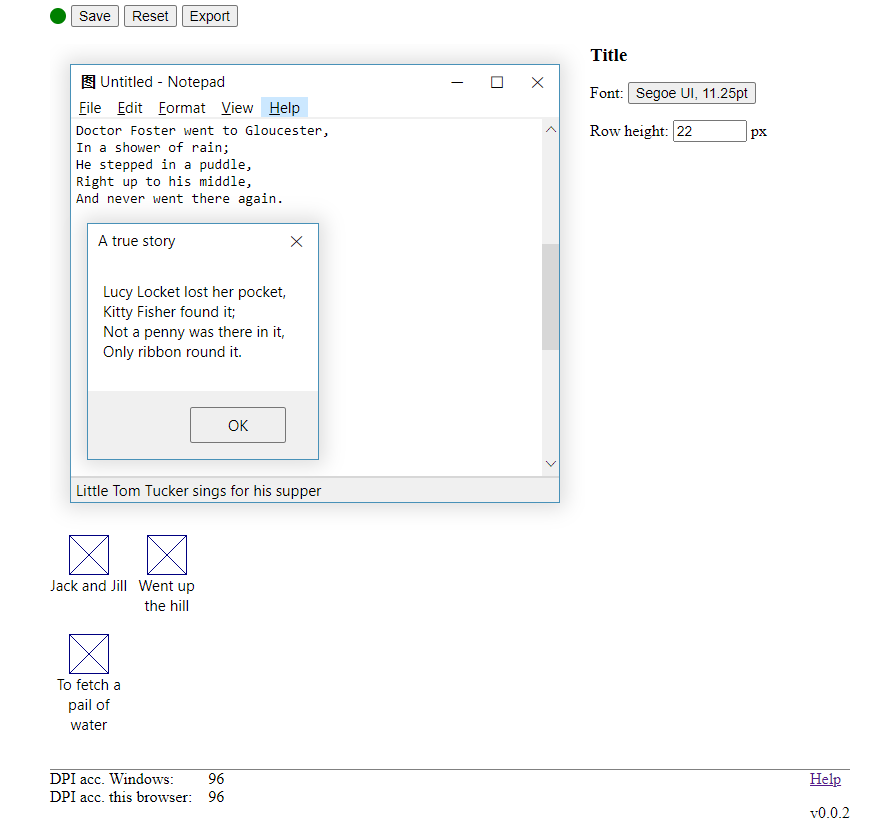

# winmetrics

Before 10 1703 Windows had a [dialog][] w/ which it was possible to
change such theme params like a font size of a window title. Now when
the dialog is gone you left either w/ a manual registry tweaking or
[various][] [tools][] than don't provide any visual guide to what
you're actually editing.

[dialog]: doc/w7__window_color_and_appearance.png
[various]: https://www.wintools.info/index.php/advanced-system-font-changer
[tools]: https://winaero.com/

Behold winmetrics:

Hovering over & clicking on a desired gui widget brings its relevant
options.

Read more info in a [blog post][].

[blog post]: http://gromnitsky.blogspot.com/2018/07/a-peek-at-old-win32-apis.html

## Installation

Download a zip, unpack, double click on `runme.js`--a browser window
should pop up. After you're done w/ the util, close the browser tab--
the server process will auto-exit after a couple of sec.

## Bugs

* An old, non-chromium based Edge is unsupported.
* I'm not sure about the math in calculating the pixel size of the
  selected font. All the docs about Logfont point back to the 90s.
* If anything goes wrong, the util won't tell you a thing until you
  open the devtools console tab.

## License

MIT.
